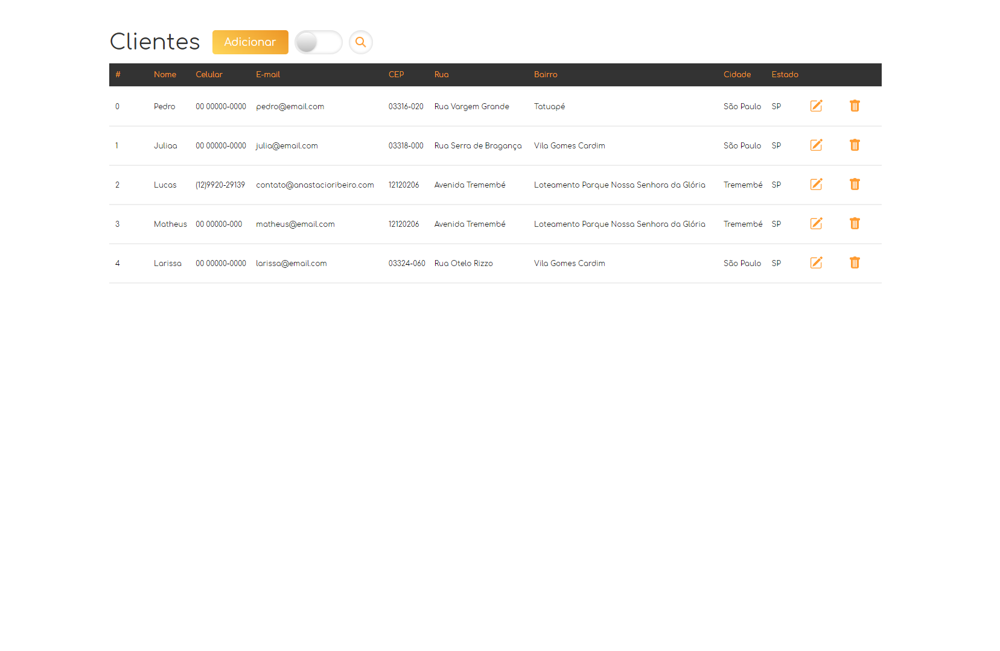

<h1 align="center">
Cadastro de Clientes
</h1>

<h1>
	
</h1>

<h2 align="center">
	<a href="https://project001.anastacioribeiro.com"> Acessar a demonstração online </a>
</h2>

## 📃 Sobre

O projeto é um **CRUD** que foi desenvolvido para o cadastro dos dados de clientes, como nome, contato e endereço.

O sistema consome a API viaCEP, fazendo com que o cadastro de endereço seja facilitada.

A aplicação utiliza de um banco de dados local do navegador ( localStorage ).

---

## ✒ Tecnologias utilizadas

O projeto foi desenvolvido utilizando as seguintes tecnologias:

- HTML5
- CSS3
- JavaScript

---

Desenvolvido por Lucas Anastácio 😆